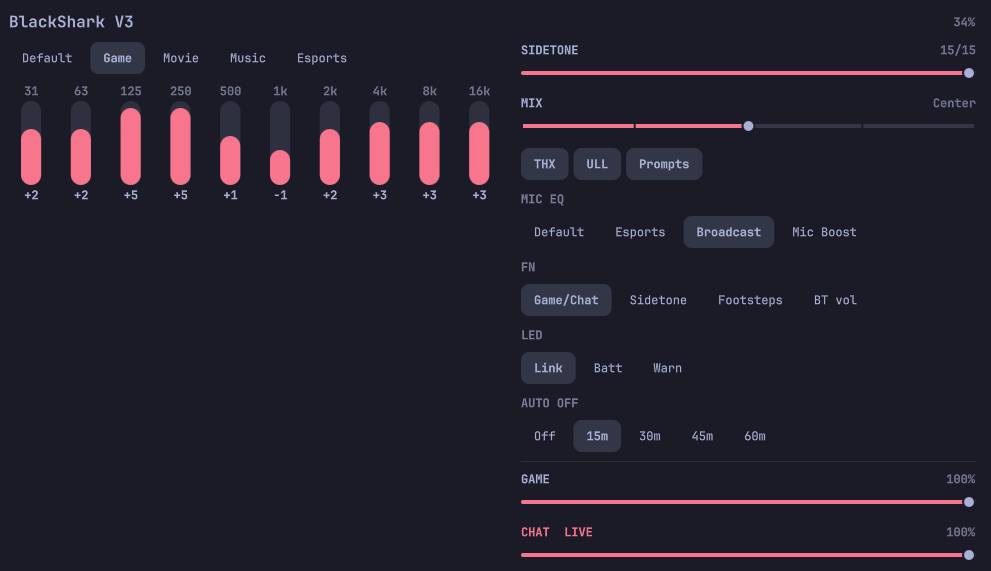

# BlackShark V3 for Omarchy

Bar widget for the Razer BlackShark V3 (USB `1532:057A`). Shows headset battery on the bar and opens a panel for EQ, sidetone, mix, THX, mic EQ, and Game/Chat send levels.



## Install

```sh
omarchy plugin add https://github.com/ReedME/omarchy-blackshark-v3.git --enable
```

That clones the plugin, validates the manifest, and places the widget on the right side of the bar (before the audio widget when that slot exists).

HID packet debug is off unless you create the debug flag before (or after) install:

```sh
mkdir -p ~/.local/state/omarchy/blackshark
touch ~/.local/state/omarchy/blackshark/debug
omarchy plugin add https://github.com/ReedME/omarchy-blackshark-v3.git --enable
```

Or later: `python3 ~/.config/omarchy/plugins/reedme.blackshark/ctl.py debug on` (and `debug off` to hide it again). Reopen the popup after toggling.

Python 3 from the base system is the only runtime dependency. No extra packages.

## Usage

The bar chip shows a headset icon and battery percent. Click it for:

- headphone EQ presets and a 10-band graphic EQ (31 Hz–16 kHz, ±6 dB)
- sidetone, Game/Chat mix, THX Spatial, ultra-low latency, audio prompts
- mic EQ presets, FN button mode, dongle LED, auto-off
- PipeWire Game and Chat send levels

HID writes go to the dongle. Battery is polled at most every five minutes so the 2.4 GHz link does not drop. Live GET telemetry on this headset often returns `0xFF` (not ready) on Linux; the bar shows `--%` until a 0–100 reading arrives. EQ and other SET controls still work.

### HID access (optional)

The first time you want live HID control, open the panel and click **Grant HID access** (or run `python3 ctl.py install-udev`). Polkit runs distro `/bin/sh` and `/usr/bin/udevadm` only — not a helper from this plugin directory — and writes a checksummed, embedded udev rule for `1532:057A` (`TAG+=uaccess`, as `70-razer-blackshark-v3.rules` so systemd's seat-late builtin can apply the ACL). The device is never made world-writable. It does not change Omarchy or PipeWire config.

## Remove

```sh
omarchy plugin remove reedme.blackshark
```

To drop the optional udev rule as well:

```sh
sudo rm -f /etc/udev/rules.d/70-razer-blackshark-v3.rules /etc/udev/rules.d/99-razer-blackshark-v3.rules
sudo udevadm control --reload-rules
```

Cached HID state lives in `~/.local/state/omarchy/blackshark/` and can be deleted after removal.

## License

MIT. Protocol notes follow public reverse engineering of the BlackShark V3 HID envelope (OpenRazer PR #2794 and related captures). This is not an official Razer product.
